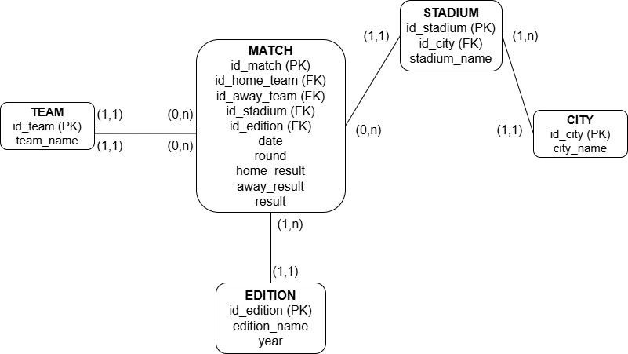
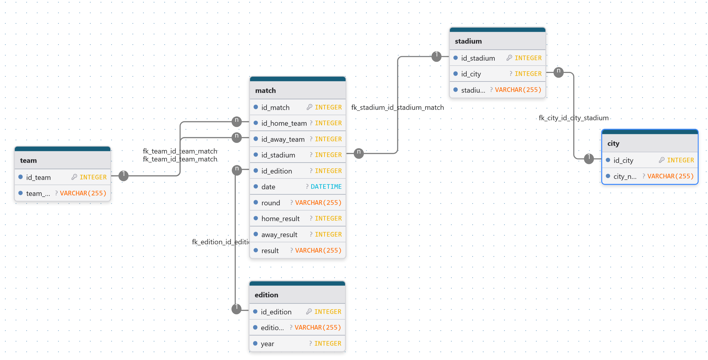

# ETL Foot World Cup (1930–2022)

Pipeline ETL complet permettant de centraliser, nettoyer, transformer et charger dans MySQL l’ensemble des matchs de Coupe du Monde FIFA (1930–2022).  
Ce projet inclut :

- extraction multi‑sources (CSV, JSON, scraping 2022)
- nettoyage avancé et harmonisation des données
- modélisation relationnelle (schéma en étoile)
- chargement MySQL automatisé
- génération de KPI SQL
- documentation technique

---

## 📁 Structure du projet

```
etl_foot_worldcup/
│
├── data_raw/                # Données brutes (non versionnées)
├── data_clean/              # Données nettoyées
│
├── etl/
│   ├── extract.py
│   ├── transform.py
│   ├── load_mysql.py
│   ├── utils.py
│   └── __init__.py
│
├── sql/
│   ├── schema.sql           # Schéma MySQL complet
│   └── queries_kpi.sql      # Requêtes KPI
│
├── config/
│   ├── db_config.example.yaml
│
├── notebooks/
│   ├── 01_clean_1930_2014.ipynb
│   ├── 02_clean_2014.ipynb
│   ├── 03_clean_2018.ipynb
│   ├── 04_fusion.ipynb
│   └── 05_tests_etl.ipynb
│
├── docs/
│   ├── etl_overview.md
│   ├── kpi.md
│   └── images/
│       ├── MCD_data_worldcup_foot_1930_2022.drawio.png
│       └── MLD_data_worldcup_foot_1930_2022.png
│
├── main.py
└── README.md
```

---

## 📘 Modèle Conceptuel de Données (MCD)



---

## 📗 Modèle Logique de Données (MLD)



---

## 🧱 Modèle de données

Le modèle relationnel repose sur un schéma en étoile :

- **Dimensions** : team, city, stadium, edition  
- **Fait** : match

Les clés étrangères assurent la cohérence entre les tables.

---

## ⚙️ Installation

### 1. Cloner le dépôt

```
git clone [https://github.com/alaugier/etl_foot_worldcup.git](https://github.com/alaugier/etl_foot_worldcup.git)
cd etl_foot_worldcup
```

### 2. Créer un environnement virtuel

```
python3 -m venv env
source env/bin/activate
pip install -r requirements.txt
```

### 3. Configurer MySQL

Créer un fichier :

```
config/db_config.yaml
```

en vous basant sur :

```
config/db_config.example.yaml
```

### 4. Créer la base et les tables

```
mysql -u root -p foot < sql/schema.sql
```

---

## ▶️ Exécuter le pipeline ETL

```
python main.py
```

Le pipeline :

1. charge les données nettoyées  
2. applique les transformations  
3. génère les dimensions et la table de faits  
4. charge le tout dans MySQL  

---

## 📊 KPI disponibles

Les requêtes SQL sont dans :

```
sql/queries_kpi.sql
```

Exemples :

- nombre de matchs par édition  
- total de buts par édition  
- moyenne de buts par match  
- équipe la plus victorieuse  
- score le plus fréquent  
- matchs les plus prolifiques  
- matchs par ville  
- matchs par stade  

---

## 👥 Auteurs

Projet réalisé dans le cadre de la formation Data Engineering.  
Dépôt personnel : **Alexandre Augier**  
Dépôt commun : *à venir*

---

## 📄 Licence

MIT License

